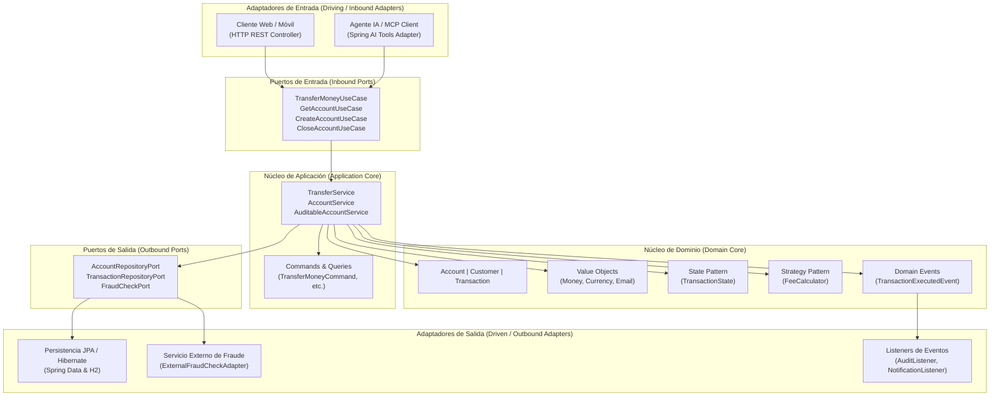

# Blue Bank API — Core Bancario Hexagonal

API de core bancario desarrollada con **Java 21** y **Spring Boot 4**, construida bajo los principios de **Arquitectura Hexagonal (Ports & Adapters)** y **Domain-Driven Design (DDD)**. 

El proyecto demuestra un desacoplamiento estricto entre las reglas del negocio financiero y sus mecanismos de entrega, ejemplificando cómo el núcleo de la aplicación puede ser conducido indistintamente por múltiples adaptadores de entrada primarios (**API REST Web** y **Agente de Inteligencia Artificial / MCP Tool Calling**) sin modificar una sola línea de la lógica de dominio.

---

## 1. Visión Arquitectónica: Hexagonal & DDD

La arquitectura aísla completamente la lógica del negocio de los frameworks, librerías de persistencia y protocolos de transporte.



### 1.1. Adaptadores de Entrada Duales (Driving Adapters)

Uno de los principales beneficios de la Arquitectura Hexagonal es la capacidad de conectar nuevos canales de interacción sin alterar la lógica de negocio ni los casos de uso:

1. **Adaptador Web REST (`infrastructure.adapter.in.rest`)**:
   * Expone endpoints HTTP estandarizados (`/api/v1/accounts`, `/api/v1/transactions`) protegidos mediante **OAuth2 Resource Server con JWT**.
   * Transforma DTOs de transporte hacia comandos de aplicación (`TransferMoneyCommand`, `CreateAccountCommand`) mediante mappers desacoplados.

2. **Adaptador de Agente IA & MCP Tools (`infrastructure.adapter.in.ai`)**:
   * Implementa `BlueBankTools` exponiendo herramientas de función (`@Tool`) integradas con **Spring AI** y preparadas para la especificación **Model Context Protocol (MCP)**.
   * Permite que un modelo de lenguaje (LLM) interprete intenciones en lenguaje natural y ejecute de forma autónoma acciones bancarias (`transferMoney`, `getAccountBalance`, `closeAccount`) invocando los mismos puertos de entrada (`TransferMoneyUseCase`, `GetAccountUseCase`) que utiliza la API REST tradicional.

### 1.2. Dominio Puro (Domain Core)

* **Sin dependencias de frameworks**: No contiene anotaciones de Spring, Jakarta Persistence (JPA) ni librerías externas. Es Java puro compilable y verificable de forma aislada.
* **Value Objects inmutables**: `Money`, `Currency` y `Email` aseguran consistencia e invariantes de negocio desde su instanciación.
* **Patrón State**: Modela el ciclo de vida estricto de las transacciones bancarias (`Pending` → `Validated` → `Executed` / `Rejected` / `Reversed`).
* **Patrón Strategy**: Cálculo polimórfico y desacoplado de comisiones transaccionales según el tipo de cuenta (`CheckingFeeCalculator`, `SavingsFeeCalculator`, `PremiumFeeCalculator`).
* **Patrón Decorator**: `AuditableAccountService` decora las operaciones bancarias registrando auditoría sin contaminar el servicio base.

### 1.3. Adaptadores de Salida (Driven Adapters)

* **Persistencia Relacional**: Implementación de `AccountRepositoryPort` y `TransactionRepositoryPort` mediante repositorios JPA e intercambio desacoplado de entidades y modelos de dominio vía **MapStruct**.
* **Integración Externa**: `ExternalFraudCheckAdapter` como consumidor del puerto de análisis de riesgo de transferencias.
* **Publicación de Eventos de Dominio**: Eventos asíncronos desacoplados (`TransactionExecutedEvent`, `AccountClosedEvent`) consumidos por escuchadores de auditoría y notificación.

---

## 2. Garantía y Gobernanza Arquitectónica (ArchUnit)

La integridad de las reglas arquitectónicas se valida automáticamente en la suite de pruebas unitarias utilizando **ArchUnit**, previniendo la degradación del diseño a través del tiempo:

* **Aislamiento del Dominio**: El paquete `domain` no puede importar ninguna clase perteneciente a `infrastructure`, `application` o dependencias de `org.springframework`.
* **Aislamiento de la Aplicación**: El paquete `application` únicamente interactúa con puertos e interfaces, teniendo prohibido acceder a implementaciones concretas de `infrastructure`.
* **Aislamiento de Seguridad**: Las reglas de seguridad de Spring Security permanecen encapsuladas exclusivamente en la capa de infraestructura.
* **Convenciones de Nomenclatura**: Controladores, adaptadores y casos de uso deben respetar la convención de sufijos establecida.
* **Prevención de Dependencias Cíclicas**: Se comprueba la ausencia de ciclos entre paquetes de la solución.

---

## 3. Stack Tecnológico

| Componente | Tecnología | Versión |
| :--- | :--- | :--- |
| **Lenguaje** | Java (LTS) | 21 |
| **Framework Base** | Spring Boot | 4.0.7 |
| **Integración IA** | Spring AI (OpenAI / Ollama / MCP spec) | 2.0.0 |
| **Seguridad** | Spring Security OAuth2 Resource Server | Compatible Spring Boot 4 |
| **Gestión de Identidades** | Keycloak | 26.0 |
| **Persistencia** | Spring Data JPA / Hibernate | 7.2 |
| **Base de Datos** | H2 Database (In-memory) | 2.4 |
| **Mapeo de Objetos** | MapStruct | 1.6.3 |
| **Testing de Arquitectura** | ArchUnit JUnit 5 | 1.3.0 |
| **Testing Unitario** | JUnit 5 & Mockito | Integrado |
| **Contenedores** | Docker Compose | 3.8+ |

---

## 4. Guía de Ejecución Local

### 4.1. Prerrequisitos

* Java Development Kit (JDK) 21 instalado y configurado en el `PATH`.
* Docker y Docker Compose activos.
* (Opcional para pruebas del agente IA) [Ollama](https://ollama.ai/) ejecutándose localmente con el modelo configurado (`ollama run qwen3:8b`).

### 4.2. Infraestructura Base (Keycloak y PostgreSQL)

El repositorio incluye la definición de servicios en `docker/docker-compose.yml` para levantar la infraestructura de autenticación:

```bash
cd docker
docker compose up -d
```

Keycloak quedará disponible en `http://localhost:8181` con credenciales administrativas por defecto (`admin` / `admin`). Debe existir o configurarse el realm `blue-bank` para la validación de tokens JWT.

### 4.3. Compilación y Ejecución de la API

Desde la raíz del proyecto:

```bash
# En entornos Windows
.\mvnw.cmd spring-boot:run

# En entornos Linux / macOS
./mvnw spring-boot:run
```

La aplicación iniciará en el puerto `8080`.
* Consola H2: `http://localhost:8080/h2-console` (JDBC URL: `jdbc:h2:mem:bluebank`, Usuario: `sa`, Contraseña: en blanco).

### 4.4. Ejecución de Pruebas Unitarias y de Arquitectura

Para ejecutar el conjunto completo de tests (incluyendo pruebas de dominio y validaciones de ArchUnit):

```bash
# Windows
.\mvnw.cmd test

# Linux / macOS
./mvnw test
```

---

## 5. Catálogo de Endpoints Principales

### 5.1. Adaptador REST (Requiere Bearer Token JWT)

#### Crear Cuenta Bancaria
```http
POST /api/v1/accounts
Content-Type: application/json
Authorization: Bearer <TOKEN_JWT>

{
  "ownerName": "Carlos Rodriguez",
  "email": "carlos.rodriguez@empresa.com",
  "accountType": "CHECKING",
  "initialBalance": 150000.00,
  "currency": "ARS"
}
```

#### Consultar Cuenta por Identificador
```http
GET /api/v1/accounts/{id}
Authorization: Bearer <TOKEN_JWT>
```

#### Transferir Fondos Entre Cuentas
```http
POST /api/v1/transactions/transfer
Content-Type: application/json
Authorization: Bearer <TOKEN_JWT>

{
  "sourceAccountId": 1,
  "targetAccountId": 2,
  "amount": 25000.00
}
```

### 5.2. Adaptador de Inteligencia Artificial (Tool Calling / MCP)

Permite canalizar solicitudes en lenguaje natural hacia el agente. El agente evalúa la intención y ejecuta autónomamente las herramientas bancarias vinculadas a los casos de uso:

```http
POST /api/v1/ai/chat
Content-Type: text/plain

"Hola, necesito consultar el saldo disponible de mi cuenta bancaria con ID 1 y transferir 5000 pesos a la cuenta con ID 2."
```
